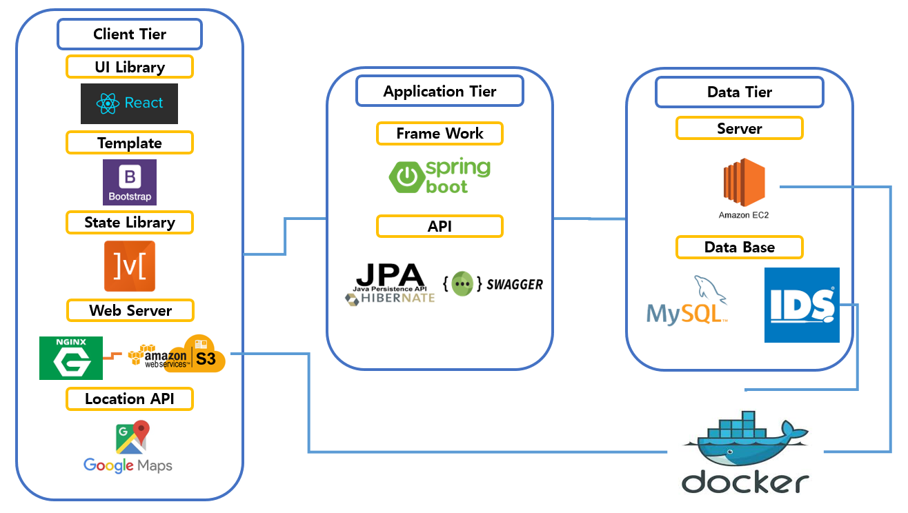

# Giant-Dish

Food Web Service

## Development Stack
<br>
<br>

## Architecture



## Boot

```
Spring start
Path :
Command Message : ./gradlew bootrun

React start
Path : /src/main/frontend
Command Message : npm start
```

## React

```
React and MobX together are a powerful combination.
React renders the application state by providing mechanisms to translate it into a tree of renderable components.
MobX provides the mechanism to store and update the application state that React then uses.
```

Reference : https://mobx.js.org/README.html
